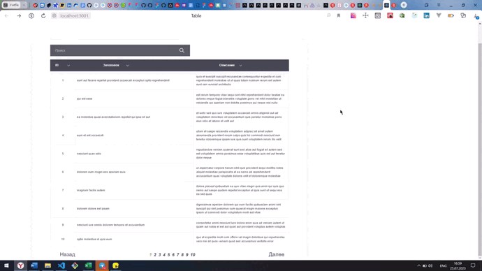

# Тестовое задание на вакансию Frontend-разработчик

~~~~~~~~~~

~~~~~~~~~~

### Стэк:
* React
* React-Router
* Redux-saga
* Redux-toolkit
* React-Bootstrap

### Задание:
Реализовать spa в соответствии с предложенным макетом, в котором будет представлена таблица с данными пользователей и возможностью сортировки и поиска.

## Общие требования:
* Приложение должно работать в chrome и firefox. 
* Разрешается использовать UI фреймворки по типу bootstrap.
* Код должен быть чистым и читабельным. 
* Не должно быть необоснованного дублирования, всё должно распределяться по компонентам.
* Код должен быть отформатирован в едином стиле. 
* Вёрстка должна совпадать с макетами figma.
* Приложение должно быть написано на react.
* Плюсом будет использование глобального state менеджера redux.
* Приложение должно быть адаптировано под различные устройства.

## Использовать API:
* [Список данных](https://jsonplaceholder.typicode.com/posts )

## Описание приложения:
* При входе на страницу отображается таблица с данными.
* На одной странице таблицы показывается только 10 записей.
* Под таблицей располагаются элементы, показывающие количество страниц таблицы.
* Кнопки “Назад” и “Далее” переключают страницы таблицы.
* Переключение между страницами происходит без перезагрузки. 
* При нажатии на заголовки столбцов происходит сортировка записей (от большего к меньшему или по алфавиту).
* В строке поиска можно ввести любое значение, и в таблице отобразится запись, в которой данное значение присутствует. Поиск по всем столбцам.
* Страница таблицы должна отображаться в URL браузера.

### Ссылки:
* :mag_right: [Открыть проект](https://gutmalina.github.io/route-display/)
* :pushpin: [Макет в Figma](https://www.figma.com/file/amcWeZhjaZ0eSyYiSNG6vN/%D0%9C%D0%B0%D0%BA%D0%B5%D1%82-%D1%82%D0%B0%D0%B1%D0%BB%D0%B8%D1%86%D1%8B?node-id=0%3A1)
